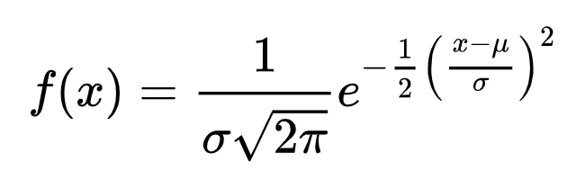

### Homework

- **homework3.tex**: 
	- Make a latex document with subsections and subsection. Put in some random text. 
	- Type up the following equations in the tex file:
	

	
- **homework3.Rmd**, answer following questions: 

	1. Make scatterplot between mpg and horsepowers for `mtcars` data, using the `plot` function. For the figure, please:
		- Use different colors and point types for cars with differnt number of cylinders. 
		- Add a legend to indicate the meaning of the point type/color. 
	
		**Hint**: 
		
		- check the `type="n"` option in the `plot` function, and the `points` function. 
		- For the `legend` function, I used `"topright"` as location instead of giving the x and y coordinates. I think it's easier. You can try other similar options, such as `"bottomleft"`. 
	
		I expect to see a figure similar to the following: 
			
	
	
	2. Create a random matrix with 3 rows and 4 columns.
	 	- Compute the sum and mean of each row and each column, using loop.
	 	- Check out the following functions: `rowMeans`, `colMeans`, `rowSums`, `colSums`. Use these functions to repeat the above calculation. 
	 	
	3. For the `mtcars` data, 
		- compute the average horse power for cars with 6 cylinders, using loop and `if-else`. Can you do this more efficiently (with fewer lines code)? 
		- compute the average mpg for cars with horse power greater less than 120, between 120 and 200, and greater than 200, using loop and `if-else`. Again, can you do this  more efficiently? 
		
	4. Include the equation required for homework3.tex in homework3.Rmd. 
	
	5. Type up the distribution density function for normal distribution (the oft-seen bell-shaped curve) in homework3.Rmd. The density function is
	
		

- Create an **example.Rmd** to reproduce everything in [http://www.math.mcgill.ca/yyang/regression/RMarkdown/example.html](http://www.math.mcgill.ca/yyang/regression/RMarkdown/example.html), follow the same style. You can just copy/paste the text so that you don't have to retype them. What you need to do is to correctly format it. 

### Day 1: Review on file I/O, data frame, list, and R base graphics

- Reread [https://www.guru99.com/r-import-data.html](https://www.guru99.com/r-import-data.html), [https://www.guru99.com/r-data-frames.html](https://www.guru99.com/r-data-frames.html), and [https://www.guru99.com/r-lists-create-select.html](https://www.guru99.com/r-lists-create-select.html). 
- Review the functions for [histogram](https://www.statmethods.net/graphs/density.html), [boxplot](https://www.statmethods.net/graphs/boxplot.html), [scatter plot](https://www.statmethods.net/graphs/scatterplot.html), [bar plot](https://www.statmethods.net/graphs/bar.html).
- Learn how to add figure legends in the R base graphics:  [http://www.sthda.com/english/wiki/add-legends-to-plots-in-r-software-the-easiest-way](http://www.sthda.com/english/wiki/add-legends-to-plots-in-r-software-the-easiest-way). 
- Do homework question 1. 

### Day 2: R control statement

- Read [https://www.guru99.com/r-if-else-elif-statement.html](https://www.guru99.com/r-if-else-elif-statement.html)
- Read [https://www.guru99.com/r-for-loop.html](https://www.guru99.com/r-for-loop.html).
- Read [https://www.guru99.com/r-while-loop.html](https://www.guru99.com/r-while-loop.html). 
- Do questions 2-3 in homework. 

### Day 3: Basic Latex

- Read [https://www.latex-tutorial.com/tutorials/](https://www.latex-tutorial.com/tutorials/), up to `04 Math`. 
- Follow the instructions to install the Latex system. 
- Work on homework3.tex. 

### Day 4: R markdown

You have learned some R, some markdown, and some Latex. Now it's time 
to put them together. From now on, I want a homework submitted in Rmarkdown format, so that the text and R code will be blended together. 

- Read [https://rmarkdown.rstudio.com/authoring_quick_tour.html](https://rmarkdown.rstudio.com/authoring_quick_tour.html). Since you already know markdown syntax, pay special attention to the parts to include R codes with markdown. 
- Learn to include equations in Rmarkdown. The equation syntax is exactly the same as in Latex: [https://www.calvin.edu/~rpruim/courses/s341/S17/from-class/MathinRmd.html](https://www.calvin.edu/~rpruim/courses/s341/S17/from-class/MathinRmd.html). 
- Start to put your homework in Rmd format. 

### Day 5: More latex and Rmarkdown

- Latex math is powerfull. I am still learning it. Read [https://en.wikibooks.org/wiki/LaTeX/Mathematics](https://en.wikibooks.org/wiki/LaTeX/Mathematics). This is pretty long and comprehensive. Just read through it to get a taste of what Latex can do.   
- Review Rmarkdown, read [http://www.math.mcgill.ca/yyang/regression/RMarkdown/example.html](http://www.math.mcgill.ca/yyang/regression/RMarkdown/example.html). 
- Work on homework questions 4-5.
