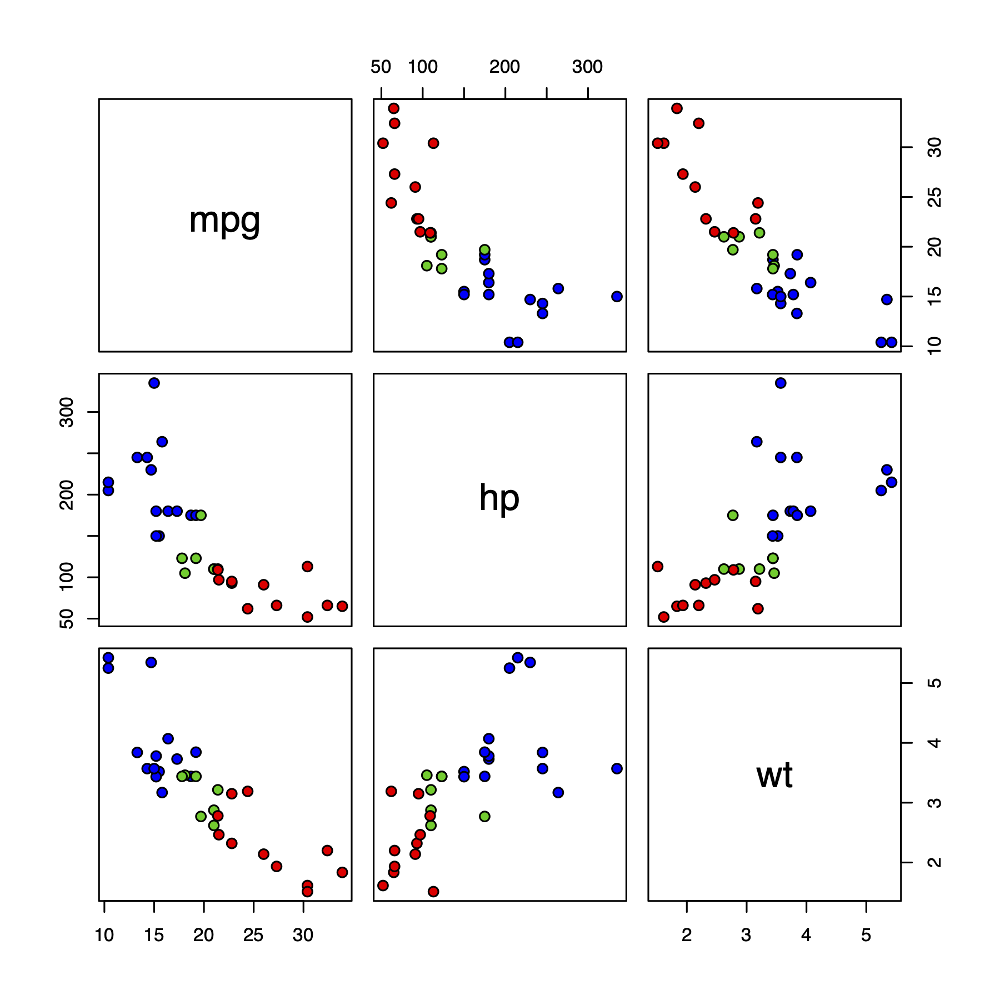
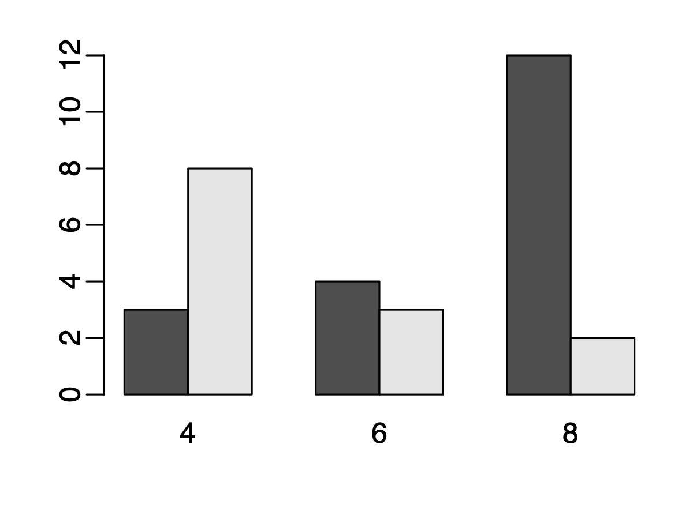

### Homework

Prepare a single file homework5.Rmd, which should include all answers, R codes, and result figures. **Note**: DO NOT generate and save figures, and then insert into Rmd. Make your Rmd _dynamic_, meaning that it will automatically generate and insert figures when you knit the Rmd. 

1. This question explores the relationship among multiple continuous variables. 
	- Explain the difference between covariance and correlation, in your own words.
	- Run following codes to generate some random numbers. Draw the scatter plot between `x` and `y`, and `x` and `y2`. Compute the covariance and correlation for each comparison. Explain what you see in the figure and what the numbers (covariance and correlation) mean.
	
		```
		x = rnorm(100)
		y = 0.5*x + rnorm(100)
		y2 = 2*x + rnorm(100)
		```
	- Run following codes to generate some random numbers. Draw the scatter plot between `x` and `y`. Compute the covariance and correlation. Explain what you see in the figure and what the numbers mean.

		```
		x = rnorm(100)
		y = x^2 + rnorm(100, sd=0.5)
		```
	- Generate the pairwise scatter plot, using `pairs` function, for the `mpg`, `hp`, and `wt` variables in the `mtcars` data frame. Also compute the pairwise correlation among these 3 variables. Explain what you see in the figure, and the meanings of the numbers. 
	- For the above pairwise scatter plot, use different colors for cars with different `cyl`. **Hint**: you need to adjust the `bg` parameters in the function. Look at the first example for the `paris` function. I expect to see a figure similar to the following: 

	
	
2. This question explores the relationship among multiple categorical variables. 
	- For the `mtcars` data frame, generate the contingency table between transmission type (`am`) and number of cylinders (`cyl`). 
	- Generate a barplot to visualize the contingency table. I expect to see something like the the figure below: 

	
		

	- Explain your observations from the table and figure, using plain language. 

	- **Bonus point**: Compute the **odds ratio** of `am` and `cyl` between cars with 4 and 8 cylinders. Can you explain the meaning of the odds ratio? 

3. This question explores the relationship among continuous and categorical variables. 
	- For `mtcars`, write a loop to compute the mean `hp` for cars with different `am`. 
	- Use `aggregate` function to repeat the above. 
	- Use your own words to explain concept of **null hypothesis**, **p-values**, and **confidence intervals**.  
	- Perform a two-group t-test to assess whether cars with different `am` have similar `hp`. Use plain language to explain the results.

4. Write an R function named `myRowSums` to compute and return the sums of all the rows in a matrix. Use the following codes to generate data and verify the results. **NOTE**: you cannot call `rowSums` function in your function. Write a loop. 

	```
	x = matrix(1:12, nrow=4)
	rowSums(x)
	myRowSums(x) ## should get the same results
	```

5. Write an R function to compute the root of a quadratic function ax^2+bx+c=0. 
	- Call your function `quadroot`. 
	- Your function will take 3 inputs for a, b, and c. Given them some default values: a=1, b=0, and c=0. 
	- Inside the function, you need to check if the quadratic function has root or not. If not, produce an error message telling the user that there is no root. Return the roots if there are. 
	- **Bonus**: you can add a new parameter to the function to optionally plot the shape of the function. So your function will be like `quadroot(a=1, b=0, c=0, plot=FALSE)`. If the users specify `plot=TRUE`, generate a figure to show the curve of the function. For that, the easiest way is to generate some x values and then plot x vs the function value. 

6. Perform a simple linear regression to explore the relationship between `wt` and `mpg` in the `mtcars`. Provide a figure (scatterplot with regression line) to show the results. Explain in plain lanuage what the results mean (e.g., the meanings of regression coefficients). 

***

### Day 1: Basic statistics - relationships among continuous data 


This week, we will learn some concept and techniques to assess the relationships among multiple variables (continuous or categorical). Today we will focus on the relationsip among continuous data. 

- Understand the [concept of continuous and categorical data](https://eagereyes.org/basics/data-continuous-vs-categorical).
- Review the [definition of variance and standard deviation](https://www.mathsisfun.com/data/standard-deviation.html). 
- Learn [the concept of correlation](https://www.mathsisfun.com/data/correlation.html).
- Understand [Correlation and covariance](https://towardsdatascience.com/getting-the-basics-of-correlation-covariance-c8fc110b90b4). Read more about this topic [here](https://www.guru99.com/r-pearson-spearman-correlation.html). 
- Look at help for R functions `cov` and `cor` for computing covariance and correlation.
- Look at the help and examples for `pairs` function, for generating pairwise scatter plot. 
- Do question 1 in the homework. 


***

### Day 2: Basic statistics - relationships among continuous and categorical data

To assess the relationship among multiple categorical data: 

- Understand [the concept of contingency table](https://en.wikipedia.org/wiki/Contingency_table). You can read up to the Odds ratio section. 
- Read the help for `table` function, which can be used to generate the contingency table. 
- A little more about [odds ratio](https://journalfeed.org/article-a-day/2018/idiots-guide-to-odds-ratios). 

To assess the relationship among continous and categorical data: 

- Read the help for `aggregate` function, play with and understand the examples. Read [a more detailed explanation](https://datascienceplus.com/aggregate-data-frame-r/). 
- Learn how to [compare means of two or more groups](https://radiant-rstats.github.io/docs/basics/compare_means.html). Try to understand the concept of **null hypothesis**, **p-values**, and **confidence intervals**.  
- Learn the [`t.test` function in R](https://statistics.berkeley.edu/computing/r-t-tests). The above link contains content we haven't talked about, such as density plot and qqplot. Ignore those if it's difficult to understand. 
- Do questions 2 and 3 in the homework. 


***

### Day 3: R functions

- Learn how to write R functions: read [https://nicercode.github.io/guides/functions/](https://nicercode.github.io/guides/functions/), and [https://www.datamentor.io/r-programming/function/](https://www.datamentor.io/r-programming/function/). 
- Do questions 4 and 5 in the homework. 


***

### Day 4: Simple linear regression 

- Understand the concept of regression analysis. Read [https://en.wikipedia.org/wiki/Regression_analysis](https://en.wikipedia.org/wiki/Regression_analysis), the opening section and the History section. 
- Understand simple linear regression.
Read [https://online.stat.psu.edu/stat462/node/79/](https://online.stat.psu.edu/stat462/node/79/), sections 2.1, 2.2, 2.3, and 2.9. 

- Learn how to use the `lm` function in R to do linear regression: [https://www.scribbr.com/statistics/simple-linear-regression/](https://www.scribbr.com/statistics/simple-linear-regression/). There are lots tutorials online. I found the above link to be the easiest to read. You can also look for others if needed. 

- Do question 6 in the homework. 


***

### Day 5: Review

- Review the contents in days 1, 2, and 4. These are very important statistical concept, and lay foundation for further more advanced statistical and data analytical methods (such as machine learning). When I say `review`, you need to read the links again. Don't be lazy. 

- Finish the homework. 
