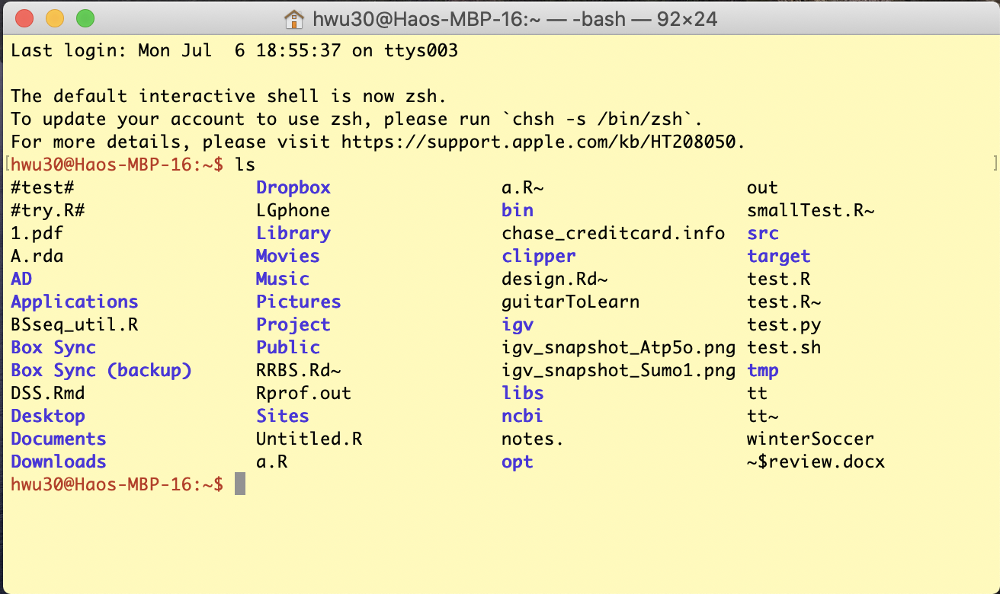

### Homework

Submit a single file **homework6.Rmd** for all questions. 

1. Basic Linux command and operation.  Perform following operations (all using Linux command in the Linux shell), answer questions and provide Linux commands used for these operations.
	- When you start the Linux shell window, how to get the current directory (provide the Linux command used)?
	- Create a folder at your root directory, provide the command. 
	- Change directory to the folder you just created. Provide the command. 
	- You have downloaded the [COVID-19 file](http://www.haowulab.org/DataSummerCamp/data/covid_19_clean_complete.csv) in Week 2. If you can't find it, download again. Copy the COVID-19 file to the folder you just created in Linux. Provide the Linux command for that. **For Windows user**: I'm not sure how the the file system works for WSL. You can try the following command to download the file in Linux. If it doesn't work, talk to me and we'll  figure out. 
		
		``` 
		wget http://www.haowulab.org/DataSummerCamp/data/covid_19_clean_complete.csv
		```
	
	- How many lines, words, and bytes are there for the COVID-19 file? Provide the command. 
	- Look at the first 10 lines of the COVID-19 file in the Linux shell. Provide the command.
	- Look at the bottom 10 lines of the COVID-19 file in the Linux shell. Provide the command.
	- Show the disk usage on your system available. Show the command and the results. 
	- Show the disk usage of the folder you just created. Show the command and the results. 

2. More advanced Linux command and operation.  Perform following operations (all using Linux command in the Linux shell), answer questions and provide Linux commands used for these operations.

	- Go to the folder you had for other homeworks. 
		- Provide a command to list all the Rmarkdown files. 
		- Provide a command to list all the Rmarkdown files, with detailed information (size, date, etc.), sort the files by date.
		- Provide a command to list all the Rmarkdown files, with detailed information (size, date, etc.), sort the files by file size.
		- Provide a command to list all files with file names **starting with** "homework". 
		- Provide a command to list all files with file names **containing** "homework".
		- Provide a command to list all the Rmarkdown files, with detailed information (size, date, etc.), sort the files by date, and redirect the list to another file named `allRmd`. Show the `allRmd` file.

	- In the COVID-19 data file (`covid_19_clean_complete.csv`), provide commands for the following:
		- Provide one line command to take out the lines contain string "`China`" and output to another file. **Hint**: use `grep` with file piping and redirection.
		- Provide one line command to get the number of lines in the file contain string "`China`". **Hint**: use a combination of `grep` 
and `wc`. 
		- Do the above two tasks in R. Provide the R codes.  

3. Read in the COVID-19 data, provide R codes and results for the following questions: 
	- What is the range of date for the data? 
	- How many days are there in the data? 
	- Take the data for US only, and plot the number of confirmed and death cases along the date. Generate two panels in the same figure, one uses original scale and one uses logrithm scale for the number of cases. Use proper axis labels and legends. I expect to see a figure similar to the following. **Hint 1**: use the `matplot` function. **Hint 2**: look at the `log` parameters in `plot` function to plot data in logrithm scale. 
	
		
				
	- Take the data for the US, compute the numbers for new confirmed and death cases for each day (using the `diff` function). Visualize the results in a figure similar to the above. 
	
	
4. Here is a [set of homework for the R programming class at Emory University](bios545_homework_3.pdf). Do the questions as much as you can. 
	
***

### Day 1: Linux system and basic commands

Linux is cool. The oft-used commands in `Linux shell` or `Terminal` are fundamental skills to have for data scientists. Once you get used to it and know it well, you'll find this command-line driven operation is much more efficient and convenient than the operation in a point-click graphical interface. 

Today, we will learn some basic linux operation and commands.

- Read [Introduction to Linux system](https://www.guru99.com/introduction-linux.html), and watch [https://www.youtube.com/watch?v=I8ik8pDTgJE](https://www.youtube.com/watch?v=I8ik8pDTgJE). It is **important to note** that we are not going to learn the whole Linux system, but only focus on Linux **shell commands**. 
- Read [Introduction to Linux Shell and Shell Scripting](https://www.geeksforgeeks.org/introduction-linux-shell-shell-scripting/). **Note**: read this to get the general concepts of kernel and shell. You don't have to read the **Shell Scripting** section.  
- Get Linux system on your computer. Most likely, you are not using a computer running linux system. 
	- If you are using Mac, Linux kernel is available on MacOS by default. Search and start the `Terminal`, which is an Linux shell interface. 
	-  If you are using Windows, Microsoft has a **Windows Subsystem for Linux (WSL)** to simulate the Linux environment. This needs to be installed. See [WSL installation page](https://docs.microsoft.com/en-us/windows/wsl/install-win10) for more details. 
-  Once you have the Linux system setup, start the terminal. Optionally you can customize the font/color to make it look comfortable. This can be important if you use the terminal a lot. For example, the Mac Terminal on my laptop looks like the following. These are the colors and fonts I feel comfortable with. 

	
	
-  Watch [Introduction to Linux and Basic Linux Commands for Beginners](https://www.youtube.com/watch?v=IVquJh3DXUA), and try them in your own shell window. 
-  Read my summary of [a list of oft-used Linux command](http://www.haowulab.org//computing/basic_linux.html). Try them in your shell window. 
-  Read [https://maker.pro/linux/tutorial/basic-linux-commands-for-beginners](https://maker.pro/linux/tutorial/basic-linux-commands-for-beginners). 
- Do homework question 1. 


***

### Day 2: More advanced Linux commands

Today we will learn some more advanced Linux commands, including Linux piping and redirection, and regular expression. 

- [A quick introduction](https://www.guru99.com/linux-pipe-grep.html). When reading this, use the COVID-19 file to try out the examples. 
- [Another brief introduction](https://alvinalexander.com/blog/post/linux-unix/linux-unix-command-mashups/). 
- [A more detailed tutorial](https://ryanstutorials.net/linuxtutorial/piping.php). This contains pretty much all you need to know. Carefully read it and play with the examples. 


- Regular expression: 
	- Read [Basic regular expression](https://www.guru99.com/linux-regular-expressions.html). Watch the video in that page. 
	- Note that regular expression can be used in many Linux commands. The above link focuses on `grep`. Read [http://www.interlude.org.uk/unix/Unix%20Reg%20exp%20stuff.htm](http://www.interlude.org.uk/unix/Unix%20Reg%20exp%20stuff.htm) for using regular expression in other commands. 
	
- Do homework question 2. 

***

### Day 3: Miscellaneous R functions, R base graphics

Today we will first learn some R functions useful for the analysis of COVID-19 data.

- The `Date` class in R: [https://www.statmethods.net/input/dates.html)](https://www.statmethods.net/input/dates.html), [https://riptutorial.com/r/topic/9015/the-date-class](https://riptutorial.com/r/topic/9015/the-date-class). 
- The `diff` function: read the function help and play with the examples. In the meantime, you can also play with the `cumsum` function.
- The `matplot` function. You have used this before. Read the function help and play with the examples to reinforce the memory. 

Next, we will do a systematic and comprehensive review of the R base graphics functionalities, even though you have learned and used some of them before.  Read the following two lecture notes. They are for a Master's level R programming class at Emory. If you understand all these, congratulation, because you are as good as a Biostatistics MS student. 

- [A high-level overview of R graphics](R_Plot-intro.html) 
- [R base graphics](R_base_graphics.html)

Do homework question 3. 

***

### Day 4 & 5: R graphics: ggplot2 

We learned R base graphics yesterday. A new R graphics system, ggplot2, is more advanced and powerful. For today and tomorrow, we'll learn ggplot2. Below is, again, the lecture notes for the Master's level R programming class at Emory. Read the slides and play with the codes. 
Skip the contents for maps (`ggmap`, the last 20 or so pages). 
Some of the content can be difficult. Do what you can. 


- [Introduction to R graphics: ggplot2](R_graphics_GGplot.pdf)

Do homework question 4. This is a real homework set for the R programming class. Talk to me if some of the questions are difficult. 