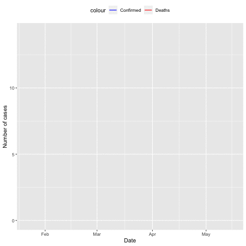

It seems the contents in weeks 5 and 6 are too heavy. I'll make this week a little more relaxing and fun. 

### Homework

1. Read in the COVID-19 data, provide R codes and results for the following questions: 
		
	- Generate an animated figure to show the total number of confirmed and death cases in the US by date. I expect to see a figure similar to the following: 
	
	

	- Do the same (animated figure) for daily new confirmed and death cases in the US. 
	
***

### Day 1 and 2: R animation 

Learn how to generate animation in R graphics. Let me know if this is difficult.  

- [https://www.listendata.com/2019/05/create-animation-in-r-learn-with.html](https://www.listendata.com/2019/05/create-animation-in-r-learn-with.html).
- [https://www.datanovia.com/en/blog/gganimate-how-to-create-plots-with-beautiful-animation-in-r/](https://www.datanovia.com/en/blog/gganimate-how-to-create-plots-with-beautiful-animation-in-r/). 
- Do homework question 1. 

### Day 3:

Review the content in week 4. Pay more attention to the R base graphics content. Review the homework. Redo homework questions 6 and 7. **Note**: don't copy your old codes. Be honest to yourself. See if you can do these homework questions faster than first time. 

### Day 4:

Review the content in week 5. Pay more attention to the R function content. Redo homework questions 4 and 5.

### Day 5:

Review the content in week 6. Pay more attention to the Linux commands. Redo homework questions 1 and 2.

