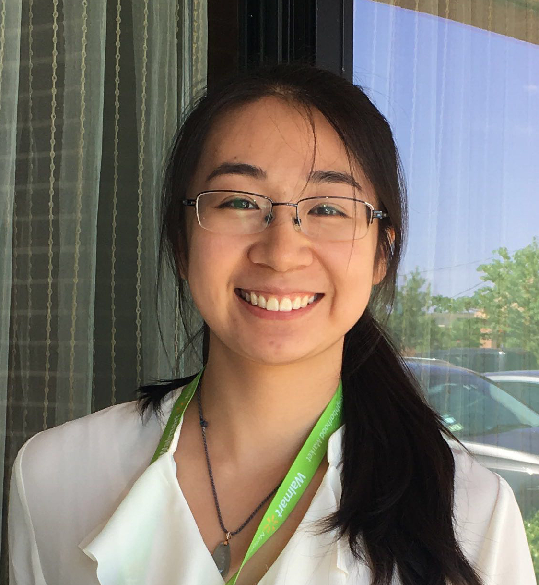
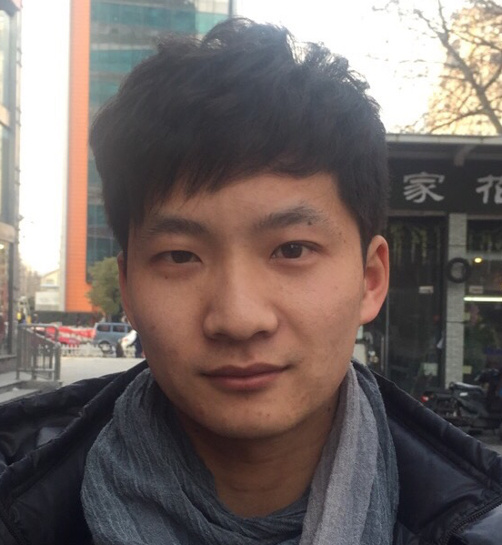

<h3>PI</h3>

  

	 
  

  
  

   <h4>Hao Wu</h4>
   Associate Professor 
   Department of Biostatistics and Bioinformatics 
   Emory University      
   

<h3>Postdoc</h3>
 

<!-- Ziyi Li -->

  

    
  

  

  <h4> Ziyi Li, Ph.D. </h4>
  Department of Biostatistics and Bioinformatics 
  Emory University  
  <a href="https://sites.google.com/site/ziyiliemory/Home">Web</a>,
 <a href="https://scholar.google.com/citations?hl=en&amp;user=dJsYA04AAAAJ&amp;view_op=list_works&amp;gmla=AJsN-F7rkvgRc
XTeTw3EC4wsNWD0dOyfoUvqNZe4oZamzss72X-OaJOHW4EHecV8c068i9U6G5jYDKvjmZkjrpwsA9FYQJzSu6an_zGxuWWCaJyJxI1sB2A">Google scholar</a>
  

 

<h3>Ph.D. students</h3>

<!-- Kenong Su -->

  

     
  

  

    <h4>Kenong Su</h4>
    Ph.D. student 
    Department of Computer Science 
   Emory University 
  

 

<!-- Zhenxing Guo -->

  

     
  

  

    <h4> Zhenxing Guo</h4>
    Ph.D. student 
    Department of Biostatistics and Bioinformatics  
    Emory University 
  

 

<!-- Luxiao Chen -->

  

     
  

  

    <h4> Luxiao Chen </h4>
    Ph.D. student 
    Department of Biostatistics and Bioinformatics  
    Emory University 
  

 

<!-- <h3>Master students</h3> -->

<h3> Former group members </h3>
<h4> Ph.D. students </h4>

<li><a href="https://sites.google.com/site/haoharryfeng"><strong>Hao "Harry" Feng</strong></a>, Ph.D. in Biostatistics, 2019. <strong>Current position</strong>: Assistant Professor, Case Western Reserve University. 
<li><a href="https://lichen-lab.github.io"><strong>Li Chen</strong></a>, 
Ph.D. in Computer Science, 2017 (joint with Steve Qin). 
<strong>Current position</strong>: Assistant Professor, Indiana University School of Medicine. 
<li><strong>Tianlei Xu</strong>, Ph.D. in Computer Science, 2017 (joint with Steve Qin). 
<strong>Current position</strong>: Senior Data Scientist, KSQ therapeutics. 
<li><strong>Ben Li</strong>, Ph.D. in  Biostatistics, 2017 (joint with Steve Qin). 
<strong>Current position</strong>: Senior Biostatistician at Merck Research Laboratories, Beijing, China.

<h4> Master's students </h4>
<li> <strong>Yuchen Yan,</strong>, MSPH in Biostatistics, 2019. 
<li> <strong>Siyi Geng,</strong>, MSPH in Biostatistics, 2019. 
<li> <strong>Xiaoran Meng,</strong>, MSPH in Biostatistics, 2019. 
<li> <strong>Xisha Weng</strong>, MSPH in Biostatistics, 2019. 
<strong>Current position</strong>: Statistical analyst, Medpace, Cincinnati, Ohio.
<li> <strong>Luxiao Chen</strong>, MSPH in Biostatistics, 2018. 
<strong>Current position</strong>: Ph.D. student in the Department of Biostatistics and Bioinformatics, Emory University. 
<li> <strong>Haonan Feng</strong>, MSPH in Biostatistics, 2017. 
<strong>Current position</strong>: Data sicentist at Shunfeng Express, Shen Zhen, China. 
<li> <strong>Hao "Harry" Feng</strong>, MSPH in Biostatistics, 2012. <strong>Current position</strong>: Assistant Professor, Case Western Reserve University.
