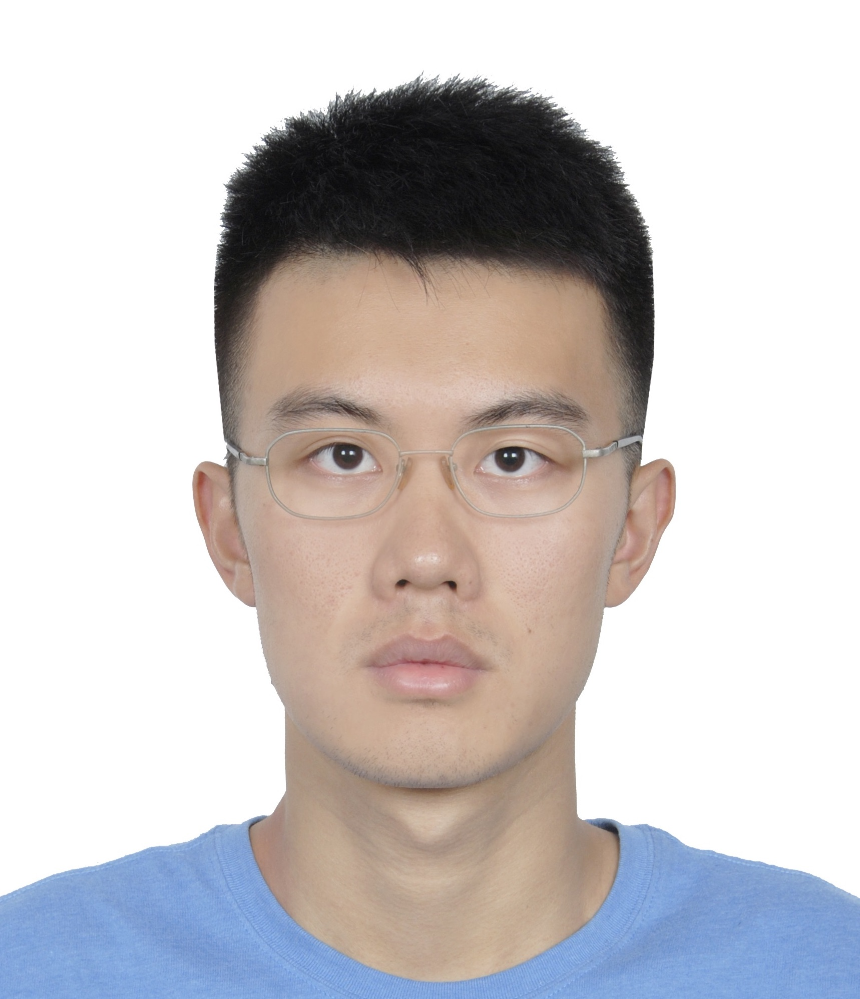

<h3>PI</h3>

  

	 
  

  
  

   <h4>Hao Wu</h4>
   Associate Professor 
   Department of Biostatistics and Bioinformatics 
   Emory University      
   

<h3>Ph.D. students</h3>

<!-- Hao Feng -->

  

	 
  

  
  

   <h4>Hao "Harry" Feng</h4>
   Ph.D. student 
   Department of Biostatistics and Bioinformatics 
   Emory University 
	<a href="https://sites.google.com/site/haoharryfeng/">Web</a>, 
 <a href="https://scholar.google.com/citations?user=YGFvJjwAAAAJ&hl=en">Google scholar</a> 
    
   

%<!-- Ben Li -->
%

%
%  

%	
%  

%  
%  

%  <h4>Ben Li</h4>
%  Ph.D. student (Joint advisee with <a href="https://sph.emory.edu/faculty/profile/#!ZQIN4">Steve Qin</a>) 
%  Department of Biostatistics and Bioinformatics 
%  Emory University 
%  <a href="https://benliemory.github.io/">Web</a>, 
% <a href="https://scholar.google.com/citations?user=nDSGBakAAAAJ&hl=en">Google scholar</a>, 
% <a href="https://github.com/benliemory">github</a>
%    
%   

%
%

<!-- Tianlei -->

  

	
  

  
  

  <h4>Tianlei Xu</h4>
  Ph.D. student (Joint advisee with <a href="https://sph.emory.edu/faculty/profile/#!ZQIN4">Steve Qin</a>) 
  Department of Mathematics and Computer Science 
  Emory University 
  <a href="https://scholar.google.com/citations?user=xCzIYMwAAAAJ&hl=en">Google scholar</a>
    
   

<h3>Master students</h3>

<!-- Luxiao Chen -->

  

    
  

  

  <h4>Luxiao Chen</h4>
  MSPH student  
  Department of Biostatistics and Bioinformatics 
  Emory University  
   
  
   

<!-- Tianyi Xu -->

  

    
  

  

  <h4> Tianyi Xu </h4>
  MSPH student  
  Department of Biostatistics and Bioinformatics 
  Emory University  
   
    
   

<h3>Research Assistant</h3>
 

<!-- Ziyi Li -->

  

    
  

  

  <h4> Ziyi Li </h4>
  Ph.D. student  
  Department of Biostatistics and Bioinformatics 
  Emory University  
   
  
   

<h3> Former group members </h3>
<ul>
<li><strong>Li Chen</strong>, Ph.D. in Computer Science, 2017 (joint with Steve Qin). 
<strong>Current position</strong>: Assistant Professor, Auburn University. 

<li> <strong>Haonan Feng</strong>, MSPH in Biostatistics, 2017. 
<strong>Current position</strong>: Data sicentist at Shunfeng Express, Shen Zhen, China. 

<li> <strong>Ben Li</strong>, Ph.D. in  Biostatistics, 2017 (joint with Steve Qin). 
<strong>Current position</strong>: Biostatistician at Merck Research Laboratories, Beijing, China. 

</ul>

    
