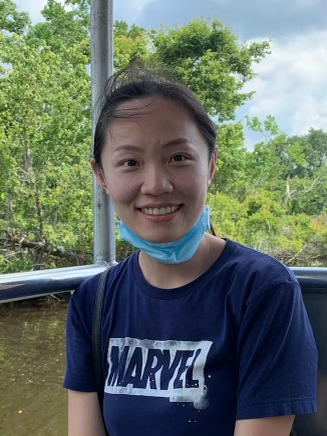

<h3>PI</h3>

  

	 
  

  
  

   <h4>Hao Wu</h4>
   Professor 
   Department of Biostatistics and Bioinformatics 
   Emory University      
   

<h3>Ph.D. students</h3>
 

<!-- Luxiao Chen -->

  

     
  

  

    <h4> Luxiao Chen </h4>
    Ph.D. student 
    Department of Biostatistics and Bioinformatics  
    Emory University 
  

 

<!-- Wenjing Ma -->

  

     
  

  

    <h4>Wenjing Ma</h4>
    Ph.D. student 
    Department of Computer Science 
   Emory University 
   <a href="https://marvinquiet.github.io/">Web</a>, 
    <a href="https://scholar.google.com/citations?user=yQOhaRAAAAAJ&hl=zh-CN">Google scholar</a>
  

 

<!-- <h3>Master students</h3> -->

<h3> Former group members </h3>

<h4> Postdoc </h4>
<li> <a href="https://sites.google.com/site/ziyiliemory"><strong>Ziyi Li</strong></a>, 2018-2020. 
<strong>Current position</strong>:
Assistant Professor, MD Anderson Cancer Center. 

<h4> Ph.D. students </h4>

<li><a href="http://zhenxingguo.org"><strong>Zhenxing Guo</strong></a>, Ph.D. in Biostatistics, 2022. <strong>Current position</strong>: Assistant Professor, School of Data Science, Chinese University of Hong Kong, Shenzhen (CUHK-SZ).
<li><a href="https://anlane611.github.io"><strong>Andrea Lane</strong></a>, Ph.D. in Biostatistics, 2022. <strong>Current position</strong>: Assistant Professor of the Practice, Duke University. 
<li><strong>Kenong Su</strong>, Ph.D. in Computer Science, 2021. <strong>Current position</strong>: Bioinformatics and Data Scientist, GRAIL. 
<li><a href="https://sites.google.com/site/haoharryfeng"><strong>Hao "Harry" Feng</strong></a>, Ph.D. in Biostatistics, 2019. <strong>Current position</strong>: Assistant Professor, Case Western Reserve University. 
<li><a href="https://lichen-lab.github.io"><strong>Li Chen</strong></a>, 
Ph.D. in Computer Science, 2017 (joint with Steve Qin). 
<strong>Current position</strong>: Assistant Professor, Indiana University School of Medicine. 
<li><strong>Tianlei Xu</strong>, Ph.D. in Computer Science, 2017 (joint with Steve Qin). 
<strong>Current position</strong>: Senior Data Scientist, KSQ therapeutics. 
<li><strong>Ben Li</strong>, Ph.D. in  Biostatistics, 2017 (joint with Steve Qin). 
<strong>Current position</strong>: Senior Biostatistician at Merck Research Laboratories, Beijing, China.

<h4> Master's students </h4>
<li> <strong> Xuan Li,</strong>, MSPH in Biostatistics, 2022. 
<li> <strong> Feier Han,</strong>, MSPH in Biostatistics, 2022. 
<li> <strong> Xin Wei,</strong>, MSPH in Biostatistics, 2021. 
<strong>Current position</strong>: Ph.D. student in the Department of Biostatistics, Brown University.
<li> <strong> Can Li,</strong>, MSPH in Biostatistics, 2020. 
<strong>Current position</strong>: Ph.D. student in the Department of Biostatistics and Data Science, University of Texas Health Science Center.
<li> <strong> Chunhui Gu,</strong>, MSPH in Biostatistics, 2020. 
<strong>Current position</strong>: Ph.D. student in the Department of Biostatistics and Data Science, University of Texas Health Science Center.
<li> <strong> Jinjing He,</strong>, MSPH in Biostatistics, 2020. 
<li> <strong> Hanyi Zheng,</strong>, MSPH in Biostatistics, 2020. 
<li> <strong>Yuchen Yan,</strong>, MSPH in Biostatistics, 2019. 
<li> <strong>Siyi Geng,</strong>, MSPH in Biostatistics, 2019. 
<li> <strong>Xiaoran Meng,</strong>, MSPH in Biostatistics, 2019. 
<li> <strong>Xisha Weng</strong>, MSPH in Biostatistics, 2019. 
<strong>Current position</strong>: Statistical analyst, Medpace, Cincinnati, Ohio.
<li> <strong>Luxiao Chen</strong>, MSPH in Biostatistics, 2018. 
<strong>Current position</strong>: Ph.D. student in the Department of Biostatistics and Bioinformatics, Emory University. 
<li> <strong>Haonan Feng</strong>, MSPH in Biostatistics, 2017. 
<strong>Current position</strong>: Data sicentist at Shunfeng Express, Shen Zhen, China. 
<li> <strong>Hao "Harry" Feng</strong>, MSPH in Biostatistics, 2012. <strong>Current position</strong>: Assistant Professor, Case Western Reserve University.
