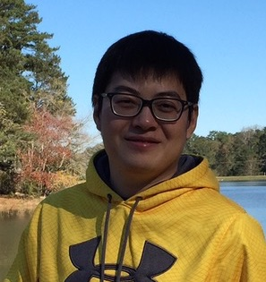

<h3>PI</h3>

  

	 
  

  
  

   <h4>Hao Wu</h4>
   Associate Professor 
   Department of Biostatistics and Bioinformatics 
   Emory University      
   

<h3>Postdoc</h3>
 

<!-- Ziyi Li -->

  

    
  

  

  <h4> Ziyi Li, Ph.D. </h4>
  Department of Biostatistics and Bioinformatics 
  Emory University  
  <a href="https://sites.google.com/site/ziyiliemory/Home">Web</a>, 
 <a href="https://scholar.google.com/citations?hl=en&user=dJsYA04AAAAJ&view_op=list_works&gmla=AJsN-F7rkvgRcXTeTw3EC4wsNWD0dOyfoUvqNZe4oZamzss72X-OaJOHW4EHecV8c068i9U6G5jYDKvjmZkjrpwsA9FYQJzSu6an_zGxuWWCaJyJxI1sB2A">Google scholar</a> 
 
    
   

   

<h3>Ph.D. students</h3>

<!-- Hao Feng -->

  

	 
  

  
  

   <h4>Hao "Harry" Feng</h4>
   Ph.D. student 
   Department of Biostatistics and Bioinformatics 
   Emory University 
	<a href="https://sites.google.com/site/haoharryfeng/">Web</a>, 
 <a href="https://scholar.google.com/citations?user=YGFvJjwAAAAJ&hl=en">Google scholar</a> 
    

<!-- Kenong Su -->

  

	 
  

  
  

   <h4>Kenong Su</h4>
   Ph.D. student 
   Department of Computer Science 
   Emory University 
      

<!-- Zhenxing Guo -->

  

	 
  

  
  

   <h4> Zhenxing Guo</h4>
   Ph.D. student 
   Department of Biostatistics and Bioinformatics  
   Emory University 
    

<h3>Master students</h3>

<!-- Xisha Weng -->

  

	 
  

  
  

   <h4> Xisha Weng </h4>
   MSPH student 
   Department of Biostatistics and Bioinformatics  
   Emory University 
  

<h3> Former group members </h3>
<ul>

<li><strong>Tianlei Xu</strong>, Ph.D. in Computer Science, 2017 (joint with Steve Qin). 
<strong>Current position</strong>: Senior Data Scientist, KSQ therapeutics. 

<li><strong>Li Chen</strong>, Ph.D. in Computer Science, 2017 (joint with Steve Qin). 
<strong>Current position</strong>: Assistant Professor, Auburn University. 

<li> <strong>Ben Li</strong>, Ph.D. in  Biostatistics, 2017 (joint with Steve Qin). 
<strong>Current position</strong>: Biostatistician at Merck Research Laboratories, Beijing, China. 

<li> <strong>Haonan Feng</strong>, MSPH in Biostatistics, 2017. 
<strong>Current position</strong>: Data sicentist at Shunfeng Express, Shen Zhen, China. 

<li> <strong>Luxiao Chen</strong>, MSPH in Biostatistics, 2018. 
<strong>Current position</strong>: Ph.D. student in the Department of Biostatistics and Bioinformatics, Emory University. 

    
