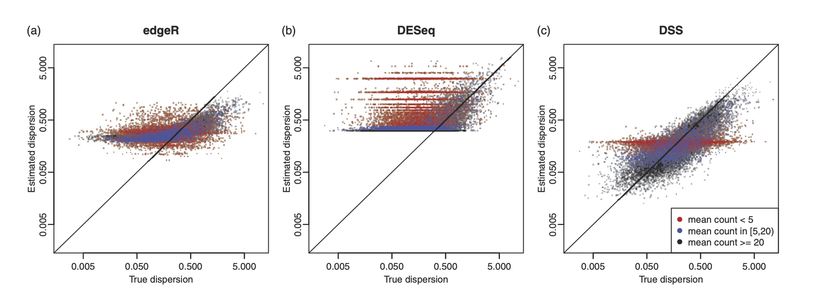
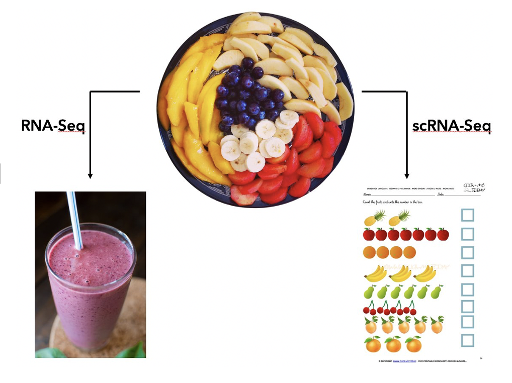
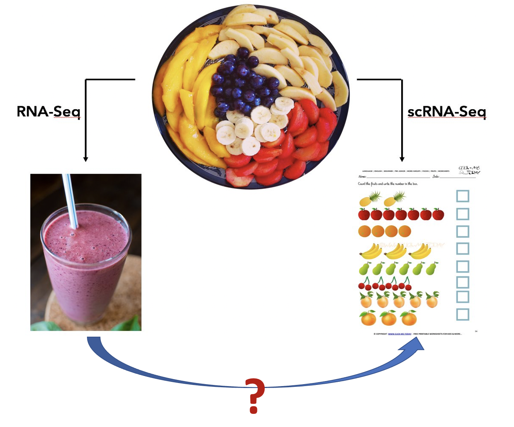

The ultimate goal of our research is to advance biomedical sciences and clinical practices through the development of rigorus and efficient tools. We aim to tackle the challenges provided by the modern biomedical "big data", including high-dimensionality, heterogeneity, technical artifacts, reproducibility, etc, and _make sense_ of the data. Over the last decade, we have developed a number of important statistical methods and widely used software packages for analyzing large-scale biomedical data, in particular high-throughput omics data. Below I provide a brief description of the research in our lab. 

### Methods for second-generation sequencing data 

#### _Bulk sequencing_

 

We have developed methods and tools for a variety of bulk sequencing data, including 

- Bulk RNA-seq: differential expression, sample size calculation. 
- Chromatin immunoprecipitation sequencing (ChIP-seq): peak calling, differential peak.
- Bisulfite sequencing (BS-seq): differential methylation. 
- Methylated RNA immunoprecipitation sequencing (MeRIP-seq): RNA methylation detection, differential RNA methylation.

In particular, we published three important papers for detecting differential methylation in BS-seq data, under various experimental designs. We characterized the sequence counts from BS-seq by a hierarchical beta-binomial model, and designed different methods for parameter estimation and statistical inference. All methods are implemented in a Bioconductor package DSS, which has become one of the most widely used tool in analyzing BS-seq data, with [annual downloads of over 20,000](http://bioconductor.org/packages/stats/bioc/DSS/). 

#### _Single cell RNA sequencing_

The picture below provides an intuitive explaination for the purpose of single cell RNA sequencing (scRNA-seq). There are many different cell types in a complex tissue (the fruit plate). The bulk RNA-seq operates on a mixture of cells and provide an weighted average of the expressions (the smoothie), while the scRNA-seq measures each individual fruit. 

Method development for scRNA-seq is the most active research field in computational biology. There are enormous amount of available data and many biological questions. We have developed several methods, including sample size calculation, differential expression, feature selection for improved cell clustering, and new metrics for evaluating cell clustering results. For example, our differential expression method SC2P uses a mixture of zero-inflated Poisson and lognormal-Poisson distributions to characterize the sparse count data from scRNA-seq, and provides flexible inferences in differential expression. Our new feature selection method FEAST significantly improves the cell clustering results. All methods are implemented as software packages freely available on Github or Bioconductor. See [Software page](http://www.haowulab.org//pages/software.html) for more details. 

### Signal deconvolution for bulk omics data 

Even though the single cell data provide much detailed information, their application in large-scale studies is difficult due to the high costs in both experiment and data analysis. So far, the bulk experiemnt is still the choice in population-level studies. Single cell data provides answers to many biological questions,  for example, cell type composition, cell type specific markers, new/rare cell type discovery, etc. We are wondering whether some of these questions can be answered by carefully analysing the bulk omics data. Our research interests in this direction can be illustrated in the figure below: can we get information for individual fruit given the smoothie?

We developed a series of methods for toward this goal. We showed that the bulk data can indeed provide some cell type specific information. Our work are  mainly in two directions: 

- _Signal deconvolution_: methods to estimate the cell type mixing proportions and pure cell type profiles.
- _Cell type specific inference_: methods to account for cell type mixture in various analyses, including cell type specific differential expression/methylation and sample clustering.

These works result in several method papers and two software packages: [InfiniumPurity](https://cran.r-project.org/web/packages/InfiniumPurify/index.html) and [TOAST](http://www.bioconductor.org/packages/release/bioc/html/DSS.html).

<!-- We also developed method for signal deconvolution and disease prediction from cell free DNA (cfDNA) methylation. The cfDNA is a mixture of DNA segment from different tissues. We perform signal deconvolution to estimate the mixing proportions, which can accurately predict disease status. The cfDNA study represents a novel and exciting direction known as “liquid biopsy”, which has great potential in early disease diagnosis. 
-->

